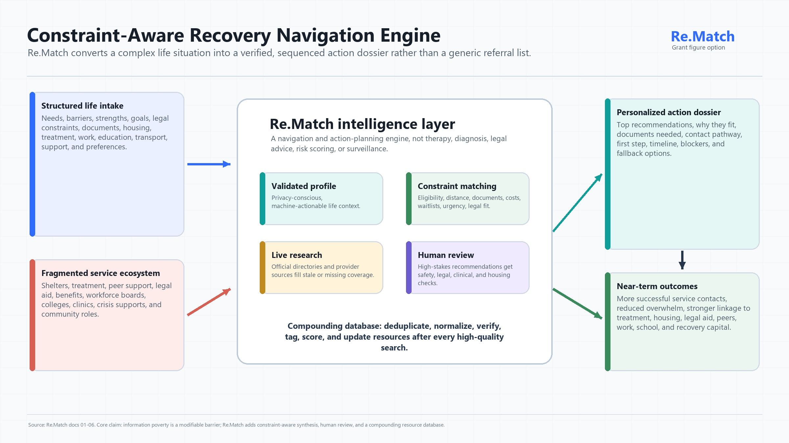

  

  # Re.Match Public Documentation
  **A Profile-Conditioned Intelligence Engine for Reducing Information Poverty and Enhancing Structural Justice in Human Recovery.**
  
  
  

 

## 🎯 The Mission
**Re.Match** is an AI-assisted opportunity, resource, and action-planning engine for people navigating reentry from incarceration, early recovery from addiction, housing instability, poverty, and systemic disruption.

Its core function is to reduce **information poverty** as a structural barrier to recovery, stability, and reintegration. Re.Match does not ask people to do more; it asks people to do one next thing—and builds the scaffold that makes that one thing possible.

---

## 📂 Repository Contents

This repository hosts the definitive public-facing documentation, architectural diagrams, and scientific foundations that govern Re.Match.

### 🏛️ Core Project Documentation
*   **[`01_ReMatch_Definitive_Project_Definition_v2.0.md`](./01_ReMatch_Definitive_Project_Definition_v2.0.md)** — The canonical project charter detailing vision, objectives, user flows, and high-level architecture.
*   **[`02_ReMatch_Scientific_Foundation_White_Paper_v1.0.md`](./02_ReMatch_Scientific_Foundation_White_Paper_v1.0.md)** — Deep dive into the theoretical, empirical, and behavioral-health science backing the system.
*   **[`03_ReMatch_Feature_to_Mechanism_Evidence_Map_v1.0.md`](./03_ReMatch_Feature_to_Mechanism_Evidence_Map_v1.0.md)** — Maps every proposed feature back to its scientific and psychological mechanism.
*   **[`04_ReMatch_Theory_of_Change_and_Evaluation_Framework_v1.0.md`](./04_ReMatch_Theory_of_Change_and_Evaluation_Framework_v1.0.md)** — Defines intended impact trajectories and strict success/failure metrics.
*   **[`05_ReMatch_Ethics_Privacy_and_Governance_Framework_v1.0.md`](./05_ReMatch_Ethics_Privacy_and_Governance_Framework_v1.0.md)** — Non-negotiable rules on data handling, privacy preservation, and harm-reduction safeguards.
*   **[`06_ReMatch_Grant_and_Credit_Adaptation_Kit_v1.0.md`](./06_ReMatch_Grant_and_Credit_Adaptation_Kit_v1.0.md)** — Frameworks for aligning Re.Match with standard grant requirements and operational funding.
*   **[`07_ReMatch_Research_Targets_and_Citation_Backbone_v1.0.md`](./07_ReMatch_Research_Targets_and_Citation_Backbone_v1.0.md)** — The complete reference list and research roadmap driving the engine's reasoning limits.
*   **[`ReMatch_Permanent_Reference_Bundle_v1.0.md`](./ReMatch_Permanent_Reference_Bundle_v1.0.md)** — A consolidated macro-document containing all foundational texts.

### 📐 Visual Architecture & Systems (JPG / PDF)
*   **Constraint-Aware Navigation Engine** ([JPG](./01_rematch_constraint_aware_navigation_engine.jpg) | [PDF](./01_rematch_constraint_aware_navigation_engine.pdf)) — Visualized mapping of the core intake-to-dossier flow.
*   **Theory of Change** ([JPG](./02_rematch_theory_of_change.jpg) | [PDF](./02_rematch_theory_of_change.pdf)) — Systems-level diagram tracing outcomes and ecosystem interactions.
*   **Evidence to Feature Mechanism Map** ([JPG](./03_rematch_evidence_to_feature_mechanism_map.jpg) | [PDF](./03_rematch_evidence_to_feature_mechanism_map.pdf)) — Detailed mapping of how evidence drives specific UI and routing choices.
*   **Pilot Evaluation Learning Flywheel** ([JPG](./04_rematch_pilot_evaluation_learning_flywheel.jpg) | [PDF](./04_rematch_pilot_evaluation_learning_flywheel.pdf)) — How the system learns safely from failure modes and operational data.

### 💼 Applications, Planning, and Templates
*   **[`Schmidt_Sciences_Application_Final.html`](./Schmidt_Sciences_Application_Final.html)** — The finalized, integrated grant application defining Re.Match as a "Trustworthy AI" project.
*   **[`REMATCH Science of Trustworthy AI RFP Budget Template.xlsx`](./REMATCH%20%20Science%20of%20Trustworthy%20AI%20RFP%20Budget%20Template.xlsx)** — The operational roadmap and budget constraints.
*   **[`(Template) (Name) Science of Trustworthy AI RFP Scientific Milestones and Outcomes Template.xlsx`](./(Template)%20(Name)%20Science%20of%20Trustworthy%20AI%20RFP%20Scientific%20Milestones%20and%20Outcomes%20Template.xlsx)** — Core timelines.

---

## 🚧 Current Development Bottlenecks
Re.Match is currently developed by a solo engineer working from within a transitional housing program. Development speed is constrained heavily by compute ceilings:
*   **Rate Limits on Frontier Models:** Complex, multi-agent AI coding sessions frequently collide with restrictive API rate limits, effectively grounding development to a halt.
*   **API Ecosystem Access:** Constructing the retrieval-augmented database of local social services requires reliable access to scraping and vector database APIs.

*This repository operates as our primary open-source intelligence layer. By contributing to or funding this infrastructure, you are helping lower the activation energy required for the most vulnerable populations to survive and stabilize.*