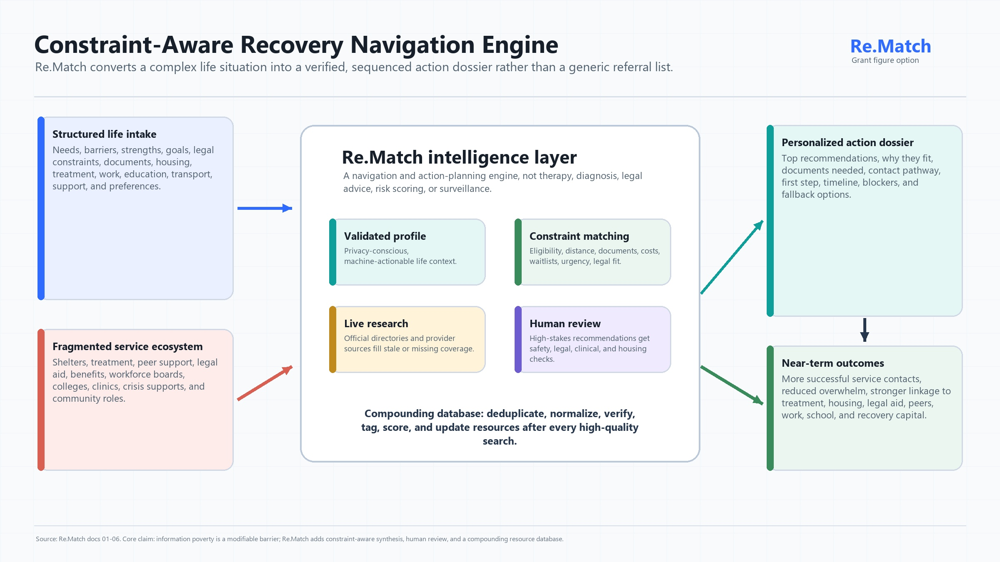

<div align="center">
  

  # Re.Match
  **Constraint-aware opportunity navigation for reentry, recovery, housing instability, and rebuilding economic agency.**

  *Public research and system-design archive · May 2026 reference baseline*
</div>

## What this project aims to solve

Someone navigating reentry, recovery, homelessness, or financial instability may face dozens of interdependent eligibility conditions, missing documents, deadlines, and program rules. A directory tells them what exists. **Re.Match is designed to help them work out which opportunities are plausible, what evidence is needed, and what to do next.**

The proposed system connects user-supplied constraints and goals to sourced opportunities, validates important conditions, and generates an actionable, prioritized navigation dossier with alternatives when an application path fails.

## What is actually in this repository

**Research and specifications, not a running public application.** This repository contains the project definition, proposed mechanisms, scientific references, evaluation design, safeguards, visual diagrams, and early grant-adaptation materials.

It does **not** contain the current application/runtime source, a deployed production service, a completed clinical study, or evidence that proposed impact metrics have already been achieved. The documents are a dated foundation for ongoing prototyping, not a list of shipped features.

| Document | Purpose |
|---|---|
| [Project definition](./01_ReMatch_Definitive_Project_Definition_v2.0.md) | Mission, user problems, envisioned workflows and architecture |
| [Scientific foundation](./02_ReMatch_Scientific_Foundation_White_Paper_v1.0.md) | Literature-informed rationale and its limitations |
| [Feature/mechanism evidence map](./03_ReMatch_Feature_to_Mechanism_Evidence_Map_v1.0.md) | Proposed features linked to hypothesized mechanisms |
| [Theory of change and evaluation](./04_ReMatch_Theory_of_Change_and_Evaluation_Framework_v1.0.md) | Testable outcomes, metrics, pilot/evaluation plan |
| [Ethics, privacy and governance](./05_ReMatch_Ethics_Privacy_and_Governance_Framework_v1.0.md) | Data minimization, agency, anti-surveillance and human-review boundaries |
| [Grant/credit adaptation kit](./06_ReMatch_Grant_and_Credit_Adaptation_Kit_v1.0.md) | Earlier funder-oriented narrative templates |
| [Research targets and citation backbone](./07_ReMatch_Research_Targets_and_Citation_Backbone_v1.0.md) | Source trail and further research agenda |
| [Consolidated reference bundle](./ReMatch_Permanent_Reference_Bundle_v1.0.md) | Historical combined reference text |

## Conceptual workflow

```text
Consent-based user intake
     ↓
Profile constraints, goals and missing evidence
     ↓
Source-linked opportunity discovery and eligibility checks
     ↓
Prioritized options with explicit uncertainty and hard gates
     ↓
Documents · contact path · next action · fallback
     ↓
User decision and human verification
```

The intended output is not an eligibility guarantee, diagnosis, legal opinion, benefits determination, or probation risk score.

## Visual specifications

| Concept | Diagram |
|---|---|
| Constraint-aware navigation | [JPG](./01_rematch_constraint_aware_navigation_engine.jpg) |
| Theory of change | [JPG](./02_rematch_theory_of_change.jpg) |
| Evidence → feature mechanism | [JPG](./03_rematch_evidence_to_feature_mechanism_map.jpg) |
| Pilot evaluation feedback loop | [JPG](./04_rematch_pilot_evaluation_learning_flywheel.jpg) |

## What must be demonstrated next

1. A reproducible end-to-end demonstration with sourced, date-stamped opportunity records.
2. Verification and provenance tests that distinguish actual program rules from assumptions or stale directories.
3. A privacy-preserving intake workflow with meaningful consent and deletion/retention boundaries.
4. Field testing with willing participants and clear human-review safeguards.
5. A measurable evaluation of whether actionability, time-to-service, and verified outcomes improve.

## Privacy and responsible use

The intended users may disclose health, housing, recovery, or legal circumstances. **Do not submit personal intake information through this documentation repository.** Re.Match must not be used as a diagnostic, clinical, legal, eligibility-decision or surveillance system. The [governance framework](./05_ReMatch_Ethics_Privacy_and_Governance_Framework_v1.0.md) defines proposed protections requiring implementation and independent validation.

## Historical materials

Older grant proposals and budget templates remain in the repository as dated research/planning artifacts; their titles, budgets and milestones do not constitute confirmation of funding, institutional endorsement, or completed work.

---

**Project stage:** research, specification and active prototyping. **Public code/demo status:** not packaged in this repository. **License:** no repository-wide license is asserted here.
